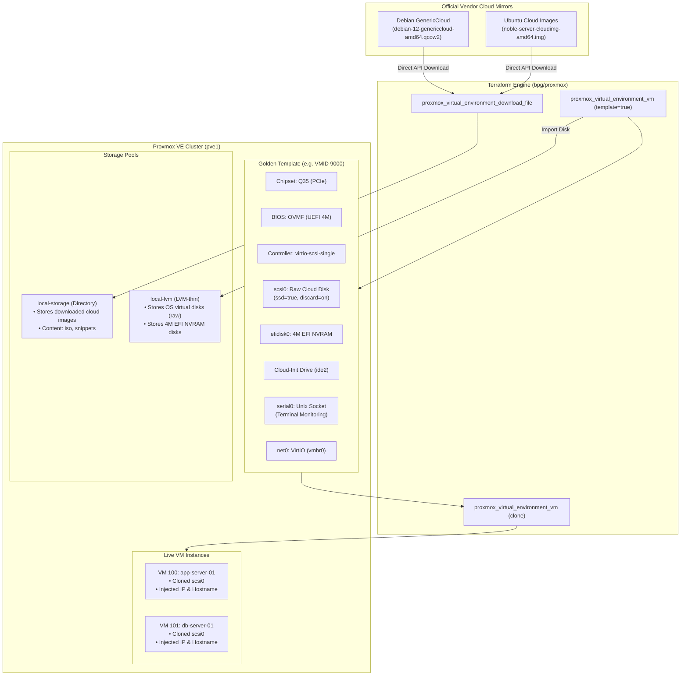
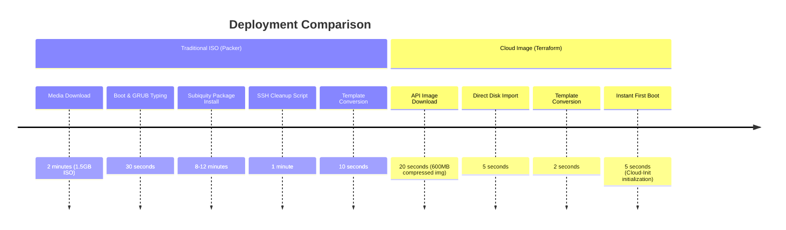

# Virtualization & Cloud-Init Architecture

This document details the architectural design, hardware baselines, storage patterns, and provisioning pipelines used in this repository to automate Proxmox VE VM templates and instances using Terraform and official Cloud Images.

---

## 1. System Architecture Overview



---

## 2. Hardware Standards & Engineering Rationale

Every virtual machine template built in this repository adheres to a standardized, modern hardware baseline:

### A. Machine Type: `q35` (PCI Express Architecture)
- **Rationale**: Legacy `i440fx` emulates a 1996 Intel chipset with PCI buses limited to 32 devices. `q35` provides a modern PCIe native topology with higher I/O bandwidth, PCIe passthrough capabilities, and advanced ACPI power management.
- **Network Interface**: On `q35`, network adapters attach as PCIe endpoints (`enp1s0`) rather than legacy slots (`ens18`).

### B. Firmware: `ovmf` (UEFI)
- **Rationale**: Modern enterprise Linux distributions boot faster and support GPT partition tables natively under UEFI.
- **EFI Disk Configuration**:
  - `datastore_id`: Placed on `local-lvm` alongside the VM virtual disk.
  - `type`: `4m` (the standard OVMF image format in Proxmox VE 8+).
  - `pre_enrolled_keys`: Pre-enrolls Microsoft and standard distro certificate keys for Secure Boot compatibility.

### C. Storage Controller: `virtio-scsi-single`
- **Rationale**: Standard `virtio-scsi` multiplexes all drives across a single shared controller queue. `virtio-scsi-single` allocates a dedicated SCSI controller instance per drive, dramatically increasing parallel I/O concurrency and eliminating queue lock contention under heavy disk load.

### D. SSD Emulation & TRIM (`ssd = true`, `discard = "on"`)
- **SSD Emulation**: Informs the guest operating system's kernel scheduler that the underlying block device has zero seek latency, activating deadline/noop I/O schedulers optimized for flash storage.
- **Discard (TRIM)**: When files are deleted inside the guest VM, the filesystem issues SCSI `UNMAP`/TRIM commands. Proxmox relays these commands to the underlying LVM-thin pool, preventing thin-pool storage bloat and immediately freeing physical SSD blocks.

### E. Headless Serial Console (`serial_device`)
- **Rationale**: Adding a serial port socket (`serial0: socket`) enables direct terminal monitoring from the command line without opening the Proxmox WebUI.
- **Access Command**:
  ```bash
  qm terminal <vmid>
  # Exit session: Ctrl + O
  ```

---

## 3. Storage Pool Decoupling

Storage is decoupled by workload to optimize reliability and performance:

| Storage Pool | Type | Content Types | Purpose in Architecture |
| :--- | :--- | :--- | :--- |
| **`local-storage`** | Directory (`/var/lib/vz`) | `iso`, `snippets` | Stores downloaded raw vendor cloud images and custom Cloud-Init YAML files. |
| **`local-lvm`** | LVM-thin | `images`, `rootdir` | Stores guest VM root hard disks (`scsi0`) and 4MB EFI NVRAM volumes (`efidisk0`). |

---

## 4. Cloud-Init vs. Traditional ISO Build Pipelines



1. **Zero OS Installation Time**: The vendor cloud image comes with the OS, kernel, and systemd pre-installed.
2. **Zero Cleanup Required**: Official cloud images are pre-sanitized by Canonical and Debian (empty `/etc/machine-id`, cleared package caches, and sealed Cloud-Init state).
3. **Dynamic Customization**: Every cloned instance pulls its identity (IP, hostname, users, SSH keys) at first boot directly from the attached Cloud-Init volume.
