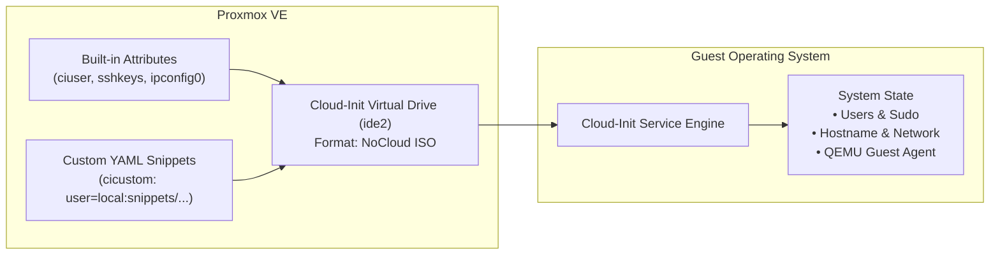

# Cloud-Init Integration & Configuration Guide

This guide details how **Cloud-Init** ([cloud-init.io](https://cloud-init.io/)) integrates with Proxmox VE and Terraform to provide instant, automated first-boot VM configuration.

---

## 1. What is Cloud-Init?

**Cloud-Init** is the industry-standard multi-distribution package that initializes virtual machines during first boot. When a cloned VM powers on for the first time, Cloud-Init reads metadata provided by the hypervisor and automatically:
- Sets the host system hostname and FQDN.
- Generates unique machine IDs and SSH host keys.
- Creates non-root administrative users and injects SSH public keys.
- Expands the root filesystem to fill the virtual disk.
- Applies static or DHCP network interface configurations.
- Runs post-provisioning scripts and installs baseline packages.

---

## 2. Proxmox Cloud-Init Mechanisms

Proxmox VE provides two complementary methods to supply configuration to the guest VM's Cloud-Init daemon via the attached virtual drive (`ide2`):



### Method A: Built-in Terraform Provider Attributes
Ideal for basic VM parameters (usernames, passwords, SSH keys, network IP):
```hcl
initialization {
  datastore_id = "local-lvm"
  ip_config {
    ipv4 {
      address = "10.10.10.50/24"
      gateway = "10.10.10.1"
    }
  }
  user_account {
    username = "erenyx"
    keys     = [var.ssh_public_key]
  }
}
```

### Method B: Custom Cloud-Init YAML Snippets (`cicustom`)
Ideal for advanced configuration adhering to the full [cloud-init.io](https://cloud-init.io/) schema (package installation, write_files, custom systemd services):
```hcl
initialization {
  datastore_id      = "local-lvm"
  user_data_file_id = proxmox_virtual_environment_file.user_data_snippet.id
}
```

---

## 3. Standard `cloud-init.io` Schema Structure

Custom snippets in `terraform/snippets/` adhere to the standard schema:

```yaml
#cloud-config
# 1. Host identity
preserve_hostname: false
fqdn: server.homelab.internal

# 2. User management and SSH key injection
users:
  - default
  - name: erenyx
    groups: [sudo, docker]
    shell: /bin/bash
    sudo: ALL=(ALL) NOPASSWD:ALL
    ssh_authorized_keys:
      - ssh-ed25519 AAAAC3NzaC1lZDI1NTE5AAAAI...

# 3. Base package installation
package_update: true
package_upgrade: false # Keep first boot fast (<10s); upgrade during maintenance cycles
packages:
  - qemu-guest-agent
  - curl
  - htop
  - ca-certificates

# 4. In-guest automated initialization commands
runcmd:
  # Ensure QEMU Guest Agent starts immediately for Proxmox IP discovery
  - systemctl enable --now qemu-guest-agent
```

---

## 4. In-Guest Verification & Troubleshooting

To monitor or troubleshoot Cloud-Init execution directly inside the guest VM:

```bash
# 1. Connect to terminal without WebUI
qm terminal <vmid>

# 2. Check overall Cloud-Init status
cloud-init status --wait

# 3. View comprehensive execution log
cat /var/log/cloud-init.log

# 4. View stdout/stderr produced by runcmd and package installations
cat /var/log/cloud-init-output.log

# 5. Validate cloud-config YAML syntax
cloud-init schema --system
```
