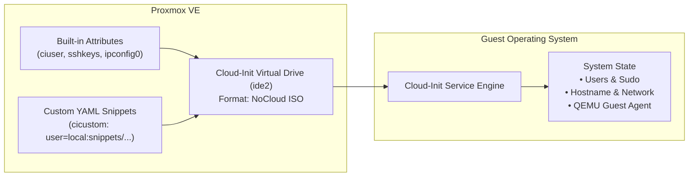

# Cloud-Init Integration & Configuration Guide

This guide details how **Cloud-Init** ([cloud-init.io](https://cloud-init.io/)) integrates with Proxmox VE and Terraform to provide instant, automated first-boot VM configuration.

---

## 1. What is Cloud-Init?

**Cloud-Init** is the industry-standard multi-distribution package that initializes virtual machines during first boot. When a cloned VM powers on for the first time, Cloud-Init reads metadata provided by the hypervisor and automatically:
- Sets the host system hostname and FQDN.
- Generates unique machine IDs and SSH host keys.
- Creates non-root administrative users and injects SSH public keys.
- Expands the root filesystem to fill the virtual disk.
- Applies static or DHCP network interface configurations.
- Runs post-provisioning scripts and installs baseline packages.

---

## 2. Proxmox Cloud-Init Mechanisms

Proxmox VE provides two complementary methods to supply configuration to the guest VM's Cloud-Init daemon via the attached virtual drive (`ide2`):



### Method A: Built-in Terraform Provider Attributes
Ideal for basic VM parameters (usernames, passwords, SSH keys, network IP):
```hcl
initialization {
  datastore_id = "local-lvm"
  ip_config {
    ipv4 {
      address = "10.10.10.50/24"
      gateway = "10.10.10.1"
    }
  }
  user_account {
    username = "erenyx"
    keys     = [var.ssh_public_key]
  }
}
```

### Method B: Custom Cloud-Init YAML Snippets (`cicustom`)
This is how `terraform/instances/` bootstraps every cloned node — one
snippet per node (not a single shared file — see the hostname note below),
each uploaded as a real Terraform-managed resource, not pushed out-of-band:
```hcl
# terraform/instances/main.tf
resource "proxmox_virtual_environment_file" "bootstrap_snippet" {
  for_each = var.nodes

  content_type = "snippets"
  datastore_id = var.proxmox_iso_pool
  node_name    = var.proxmox_node

  source_raw {
    file_name = "bootstrap-${each.key}.yaml"
    data = templatefile("${path.module}/../snippets/bootstrap.yaml.tftpl", {
      ci_username    = var.ci_username
      ssh_public_key = trimspace(var.ssh_public_key)
      hostname       = each.key
    })
  }
}

module "node" {
  # ...
  user_data_file_id = proxmox_virtual_environment_file.bootstrap_snippet[each.key].id
}
```

**Important gotcha — Method A and Method B are not additive.** Once a VM's
`cicustom` (`user_data_file_id`) is set for the user-data section, Proxmox
drops its own generated `ciuser`/`cipassword`/`sshkeys` config entirely for
that VM — a `user_account` block set alongside a custom snippet is silently
ignored, not merged. A previous version of this repo got bitten by exactly
this: `terraform/modules/vm-instance` set both, `terraform/snippets/bootstrap.yaml`
had no `users:` section, and every cloned node booted with cloud-init
falling back to the base image's default `ubuntu` user with **no**
authorized SSH keys — confirmed via the serial console (`qm terminal
<vmid>`): `ci-info: no authorized SSH keys fingerprints found for user
ubuntu`. The fix: the admin user + SSH key now live in the snippet itself
(templated, not static — see below), and `vm-instance`'s `user_account`
block is only emitted (via a `dynamic` block) when `user_data_file_id` is
null, so it never implies functionality it can't deliver.

**Second gotcha — a shared snippet can't carry a per-node hostname.** The
snippet was originally one resource uploaded once and reused by all 4
nodes; every node then booted with hostname `ubuntu` (the base image's
default) instead of its real name, because nothing in that shared file (or,
reliably, in Proxmox's own per-VM metadata) set it. Fixed by making
`bootstrap_snippet` a `for_each` over `var.nodes` — each node gets its own
rendered file with its own `hostname:` key (see the schema below).

---

## 3. Standard `cloud-init.io` Schema Structure

`terraform/snippets/bootstrap.yaml.tftpl` stays scoped to "make the node
reachable for Ansible" — that now includes the admin user and its SSH key
(see the gotcha above for why they have to live here), plus
qemu-guest-agent and python3. **Still nothing role-specific**: no extra
groups beyond `sudo`, no MOTD/`write_files`, no per-role packages. All of
that belongs in an Ansible role once the `ansible/` layer exists. An
earlier, fuller version of this snippet (`erenyx-base.yaml`) mixed those
concerns in and was reverted for exactly that reason — see `CLAUDE.md`.

```yaml
#cloud-config
hostname: ${hostname}
manage_etc_hosts: true

users:
  - name: ${ci_username}
    groups: [sudo]
    shell: /bin/bash
    sudo: "ALL=(ALL) NOPASSWD:ALL"
    lock_passwd: true
    ssh_authorized_keys:
      - ${ssh_public_key}

package_update: true
package_upgrade: false

packages:
  - qemu-guest-agent
  - python3

runcmd:
  - systemctl enable --now qemu-guest-agent
```

No `default` entry in `users:`, so the base image's default user (`ubuntu`)
is not created alongside the admin user above.

---

## 4. In-Guest Verification & Troubleshooting

To monitor or troubleshoot Cloud-Init execution directly inside the guest VM:

```bash
# 1. Connect to terminal without WebUI
qm terminal <vmid>

# 2. Check overall Cloud-Init status
cloud-init status --wait

# 3. View comprehensive execution log
cat /var/log/cloud-init.log

# 4. View stdout/stderr produced by runcmd and package installations
cat /var/log/cloud-init-output.log

# 5. Validate cloud-config YAML syntax
cloud-init schema --system
```
