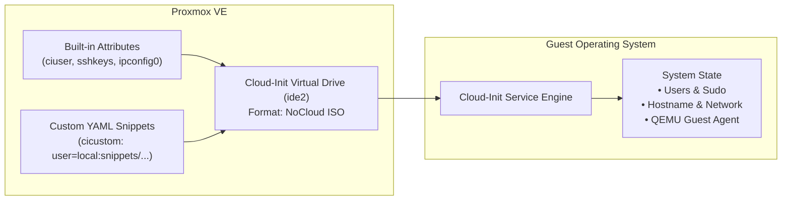

# Cloud-Init Integration & Configuration Guide

This guide details how **Cloud-Init** ([cloud-init.io](https://cloud-init.io/)) integrates with Proxmox VE and Terraform to provide instant, automated first-boot VM configuration.

---

## 1. What is Cloud-Init?

**Cloud-Init** is the industry-standard multi-distribution package that initializes virtual machines during first boot. When a cloned VM powers on for the first time, Cloud-Init reads metadata provided by the hypervisor and automatically:
- Sets the host system hostname and FQDN.
- Generates unique machine IDs and SSH host keys.
- Creates non-root administrative users and injects SSH public keys.
- Expands the root filesystem to fill the virtual disk.
- Applies static or DHCP network interface configurations.
- Runs post-provisioning scripts and installs baseline packages.

---

## 2. Proxmox Cloud-Init Mechanisms

Proxmox VE provides two complementary methods to supply configuration to the guest VM's Cloud-Init daemon via the attached virtual drive (`ide2`):



### Method A: Built-in Terraform Provider Attributes
Ideal for basic VM parameters (usernames, passwords, SSH keys, network IP):
```hcl
initialization {
  datastore_id = "local-lvm"
  ip_config {
    ipv4 {
      address = "10.10.10.50/24"
      gateway = "10.10.10.1"
    }
  }
  user_account {
    username = "erenyx"
    keys     = [var.ssh_public_key]
  }
}
```

### Method B: Custom Cloud-Init YAML Snippets (`cicustom`)
This is how `terraform/instances/` bootstraps every cloned node — the
snippet is uploaded as a real Terraform-managed resource, not pushed
out-of-band:
```hcl
# terraform/instances/main.tf
resource "proxmox_virtual_environment_file" "bootstrap_snippet" {
  content_type = "snippets"
  datastore_id = var.proxmox_iso_pool
  node_name    = var.proxmox_node

  source_file {
    path = "${path.module}/../snippets/bootstrap.yaml"
  }
}

module "node" {
  # ...
  user_data_file_id = proxmox_virtual_environment_file.bootstrap_snippet.id
}
```

---

## 3. Standard `cloud-init.io` Schema Structure

`terraform/snippets/bootstrap.yaml` is intentionally minimal — its only job
is to make the node reachable for Ansible. **Nothing role-specific goes
here**: no `users:` (Terraform's own `user_account` block already handles
the admin user — defining it twice is a real footgun, not just style), no
groups, no MOTD/`write_files`, no per-role packages. All of that belongs in
an Ansible role once the `ansible/` layer exists. An earlier, fuller
version of this snippet (`erenyx-base.yaml`) mixed those concerns in and
was reverted for exactly that reason — see `CLAUDE.md`.

```yaml
#cloud-config
package_update: true
package_upgrade: false

packages:
  - qemu-guest-agent
  - python3

runcmd:
  - systemctl enable --now qemu-guest-agent
```

---

## 4. In-Guest Verification & Troubleshooting

To monitor or troubleshoot Cloud-Init execution directly inside the guest VM:

```bash
# 1. Connect to terminal without WebUI
qm terminal <vmid>

# 2. Check overall Cloud-Init status
cloud-init status --wait

# 3. View comprehensive execution log
cat /var/log/cloud-init.log

# 4. View stdout/stderr produced by runcmd and package installations
cat /var/log/cloud-init-output.log

# 5. Validate cloud-config YAML syntax
cloud-init schema --system
```
